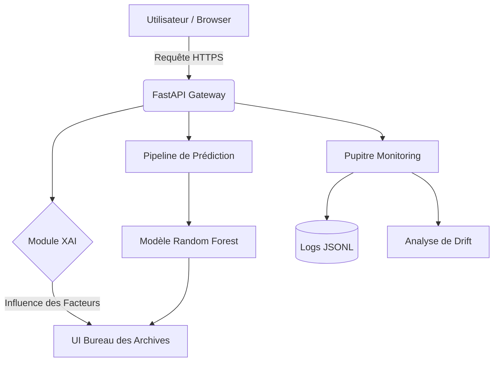

# 🚢 Titanic MLOps Platform : IA Explicable & Gouvernance Industrielle

[](https://titanic-c021df7f.fastapicloud.dev)
[](https://github.com/Moustapha-Ndoye-dev/TP_ML_TITANIC)
[](https://titanic-c021df7f.fastapicloud.dev)
[](https://titanic-c021df7f.fastapicloud.dev)

Bienvenue sur la **Titanic MLOps Platform**, un écosystème complet de production conçu pour l'industrialisation des modèles de Machine Learning. Ce projet transforme le célèbre dataset du Titanic en un service cloud souverain, hautement disponible et transparent grâce à l'**IA Explicable (XAI)**.

---

## 🚀 Démo en Direct
Accédez à l'environnement de production ici :
👉 **[https://titanic-c021df7f.fastapicloud.dev](https://titanic-c021df7f.fastapicloud.dev)**

---

## 📐 Architecture du Système



---

## 🧠 IA Explicable (XAI) : Pourquoi le modèle survit ?
Contrairement aux modèles "boîte noire", notre plateforme décompose chaque décision pour offrir une transparence totale. Pour chaque prédiction, le système calcule trois vecteurs d'influence :

*   **Influence Sociale** : Impact de la classe (PClass) et du tarif payé.
*   **Influence Profil** : Impact du sexe, de l'âge et de la structure familiale.
*   **Influence Proximité** : Impact de la cabine et du port d'embarquement.

---

## 📊 Gouvernance MLOps & Monitoring
La plateforme intègre un cycle de vie MLOps complet conforme aux standards industriels :

1.  **Surveillance Système** : Télémétrie en temps réel (CPU, RAM, Latence).
2.  **Détection de Dérive (Data Drift)** : Analyse statistique entre les données d'entraînement et les entrées utilisateur pour garantir la stabilité du modèle.
3.  **Persistance Résiliente** : Journalisation des prédictions au format JSONL pour l'auditabilité.
4.  **Déploiement Continu** : Intégration optimisée avec FastAPI Cloud.

---

## 🛠️ Stack Technique
*   **Backend** : FastAPI (Asynchrone, Python 3.9+)
*   **Frontend** : Vanilla HTML5 / CSS3 / JavaScript (Design Glassmorphism)
*   **Machine Learning** : Scikit-Learn (Random Forest)
*   **Données** : Pandas, NumPy, Joblib
*   **Hébergement** : FastAPI Cloud

---

## 📖 API Reference (Developer Guide)

### Effectuer une Prédiction
`POST /predict`
```json
{
  "Pclass": 3,
  "Sex": "male",
  "Age": 22,
  "SibSp": 1,
  "Parch": 0,
  "Fare": 7.25,
  "Embarked": "S"
}
```

### Statistiques de Monitoring
`GET /monitoring/system`
Retourne les métriques de santé du serveur en temps réel.

---

## 🔐 Accès Administratif (Démonstration)
Le pupitre de monitoring est accessible via `/monitor`.
*   **Identifiant** : `moustapha`
*   **Mot de passe** : `mlops`

---

© 2026 Titanic MLOps Platform — Division Gérance des Risques. Les prédictions sont basées sur des probabilités statistiques historiques.
